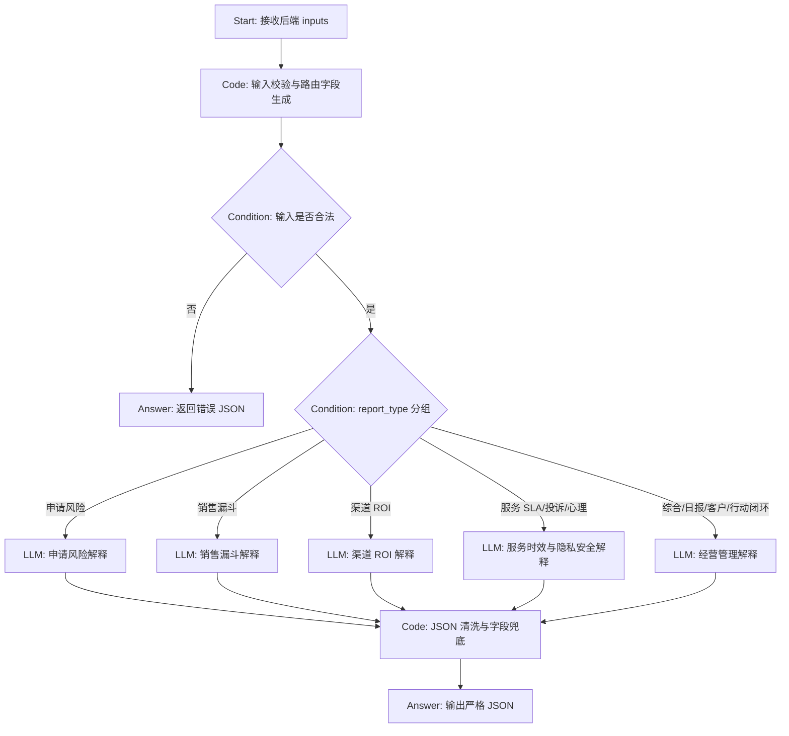

# 智能报告 Chatflow 设计文档

> 模块：智能报告 V2  
> 产物类型：Dify Chatflow 配置手册 + DSL/YAML 草案  
> 适用项目：`education-service-api`  
> 设计目标：让后端已经完成的智能报告模块，可以通过 Dify Chatflow 补充管理解释、总结和建议，同时避免大模型改写业务数字。

## 0. 文档定位

这份文档不是单纯介绍 Dify 是什么，而是面向项目交付的配置说明。

它要解决的问题是：后端已经完成智能报告模块，接下来需要在 Dify 中搭建一个 Chatflow，让它基于后端传入的结构化聚合数据，生成可读的 `summary` 和 `explanation`。

一句话概括：

> 后端负责算准，Dify 负责讲清楚；Dify 不能编数字，只能解释后端已经算好的数字。

对应后端链路：

```text
POST /api/v1/reports/generate
-> create_report_task
-> generate_report_async
-> aggregate_report
-> enrich_content_with_ai
-> Dify Chatflow /chat-messages
-> Pydantic Schema 校验
-> render_report_html
-> GET /api/v1/reports/{id}
```

参考文件：

- `routers/report.py`：报告生成、查询、重试、行动项接口。
- `services/reporting/orchestrator.py`：报告任务编排层。
- `services/reporting/aggregators.py`：SQL 聚合和业务指标计算层。
- `services/reporting/rules.py`：风险分、转化率、ROI、SLA 等确定性规则。
- `services/reporting/ai_generator.py`：Dify Chatflow 调用和返回解析。
- `services/reporting/schemas.py`：报告内容 Pydantic Schema。
- `doc/智能报告模块V2_前端对接与Dify契约.md`：前端和 Dify 契约说明。

参考 Dify 官方文档：

- [Dify API Get Started](https://docs.dify.ai/en/api-reference/guides/get-started)
- [Dify API Integration](https://docs.dify.ai/en/cloud/use-dify/publish/developing-with-apis)
- [Dify Chatflow Tutorial](https://docs.dify.ai/en/learn/tutorials/twitter-chatflow)
- [Dify App Management / DSL](https://docs.dify.ai/en/cloud/use-dify/workspace/app-management)

## 1. 判断维度：先判断这个 Chatflow 到底要解决什么

### 1.1 问题层级

表面问题是“搭一个 Dify Chatflow 生成智能报告”。

真实问题不是让大模型重新生成报告，而是让它把后端已经算好的指标解释成管理者能读懂、能决策、能追责的报告说明。

如果让 Dify 直接生成完整报告，会出现三个风险：

- 指标可能被大模型改写，例如高风险数量、ROI、SLA 超时数不再可信。
- 前端无法稳定渲染，因为每次输出结构可能不同。
- 面试或答辩时解释不清“这些数字到底从哪里来”。

所以本项目的设计原则是：

```text
数据库事实表 + 规则引擎 = 业务数字
Dify Chatflow = 总结、解释、管理建议表达
Pydantic Schema = 最终结构校验
```

### 1.2 使用场景

这个 Chatflow 主要服务于后台报告生成任务，不是让用户在网页上自由聊天。

典型场景：

- 管理员手动生成“申请风险报告”。
- 系统定时生成“综合经营周报”。
- 员工或主管查看“服务 SLA 报告”。
- 管理者把报告建议转成 `report_action` 行动项。

请求来源不是普通用户自由输入，而是 FastAPI 后端调用 Dify API。

### 1.3 目标意图

Chatflow 的目标不是“多写一点”，而是做到四件事：

1. 把聚合指标转成管理摘要。
2. 解释指标背后的业务含义。
3. 保留数据质量警告，不掩盖空数据或降级数据。
4. 严格返回 JSON，方便后端解析和 Schema 校验。

### 1.4 对象水平

文档面向三类读者：

| 读者 | 他们关心什么 | 文档要给什么 |
|---|---|---|
| Dify 配置同学 | 节点怎么搭、变量怎么填 | 节点级配置说明 |
| 后端开发同学 | Dify 入参出参怎么和 FastAPI 对接 | API 契约、JSON 示例、异常处理 |
| 面试和答辩同学 | 为什么这样设计，企业价值是什么 | 项目表达、追问回答、风险边界 |

### 1.5 风险误解

最容易误解的是：用了 Dify，就以为报告数字由 Dify 生成。

这里必须提前堵住：

- Dify 不查数据库。
- Dify 不计算风险分。
- Dify 不计算转化率。
- Dify 不计算 CPL、CAC、ROI。
- Dify 不判断 SLA 是否超时。
- Dify 不输出心理咨询原文。

Dify 只看后端传入的 `aggregated_data`，并补充 `summary` 和 `explanation`。

### 1.6 行动出口

读完本文档后，实施者应该能完成三件事：

1. 在 Dify 控制台创建一个 `advanced-chat` 类型的 Chatflow。
2. 按节点说明完成 Start、Code、Condition、LLM、Answer 节点配置。
3. 用后端 `REPORT_AI_MODE=dify` 联调，确认报告任务可以生成并通过 Schema 校验。

## 2. 回复逻辑：为什么后端算指标，Dify 只解释

### 2.1 真实任务识别

智能报告模块不是内容创作模块，而是管理分析模块。

管理分析最重要的是可信数字。比如：

- 申请风险报告要看高风险申请有多少。
- 销售漏斗报告要看各阶段线索数量和签约率。
- 渠道 ROI 报告要看成本、线索数、签约数、回款和 ROI。
- 服务 SLA 报告要看首次响应和解决时效是否超时。
- 行动闭环报告要看行动项完成率和逾期数量。

这些内容如果交给大模型自由生成，结果就不可追溯。

所以后端已经把职责拆清楚：

```text
aggregators.py 负责 SQL 聚合
rules.py 负责确定性规则计算
schemas.py 负责结构约束
ai_generator.py 负责调用 Dify 并合并解释字段
renderer.py 负责后端 HTML 渲染
```

### 2.2 缺口判断

后端已经有数字，但这些数字对管理者来说还不够。

比如后端可以算出：

```json
{
  "total_applications": 12,
  "high_risk_count": 3,
  "missing_material_count": 8
}
```

但管理者真正想知道的是：

```text
这说明本周申请风险集中在哪里？
负责人接下来应该先处理什么？
数据有没有缺失，报告还能不能信？
```

Dify 的价值就在这里：把数字翻译成管理语言。

### 2.3 回答模式选择

这个 Chatflow 采用“结构化解释型”模式：

```text
输入：后端确定性数据
处理：按报告类型选择解释重点
输出：summary + explanation
边界：不改写任何业务数字
验证：后端 Pydantic Schema 校验
```

### 2.4 深度控制

Chatflow 不需要做复杂多轮对话，也不需要接入知识库。

原因：

- 报告数据已经由后端传入。
- 报告内容必须可控，越自由越难校验。
- 后端调用 Dify 使用 `blocking` 模式，目标是任务生成，不是长对话陪聊。

因此第一版只保留必要节点，先保证稳定：

```text
Start
-> Code 输入校验和路由字段生成
-> Condition 非法输入拦截
-> Condition 报告类型分组
-> LLM 生成 JSON
-> Code JSON 兜底清洗
-> Answer 输出
```

### 2.5 一句话表达

> 这个 Chatflow 的核心不是让 Dify 重新做报告，而是让 Dify 基于后端可信指标，生成可校验、可渲染、可追溯的管理解释。

## 3. 回答框架：Chatflow 总体架构

### 3.1 应用类型

在 Dify 中创建应用时选择：

```text
Create from Blank
-> Chatflow
```

API 模式对应：

```text
advanced-chat
```

后端调用接口：

```text
POST {DIFY_API_URL}/chat-messages
```

请求体结构：

```json
{
  "inputs": {
    "report_type": "application_risk",
    "schema_version": 2,
    "report_title": "申请风险周报",
    "period": {"start": "2026-07-01", "end": "2026-07-07"},
    "aggregated_data": {},
    "expected_schema": {},
    "data_quality": {"level": "ok", "warnings": [], "data_source": "database"}
  },
  "query": "请基于 inputs 中的后端聚合数据生成本报告的 summary 和 explanation。禁止改写任何业务数字。请只返回 JSON 对象。",
  "response_mode": "blocking",
  "user": "report-service"
}
```

注意：后端从 Dify Chatflow 的 `answer` 字段中解析 JSON。

### 3.2 总体节点图



### 3.3 节点清单

| 节点编号 | 节点类型 | 节点名称 | 作用 |
|---|---|---|---|
| N1 | Start | 接收后端报告上下文 | 定义后端传入变量 |
| N2 | Code | validate_and_route_report | 校验必填字段，生成报告分组和表达规则 |
| N3 | Condition | 输入合法性判断 | 非法输入直接返回错误 JSON |
| N4 | Condition | report_type 路由 | 根据报告类型选择解释重点 |
| N5A | LLM | application_risk_explainer | 解释申请风险报告 |
| N5B | LLM | sales_funnel_explainer | 解释销售漏斗报告 |
| N5C | LLM | channel_roi_explainer | 解释渠道 ROI 报告 |
| N5D | LLM | service_privacy_explainer | 解释 SLA、投诉、心理预警报告 |
| N5E | LLM | management_report_explainer | 解释经营、日报、周报、行动闭环报告 |
| N6 | Code | normalize_json_answer | 清洗 LLM 输出，保证 JSON 格式 |
| N7 | Answer | 返回后端可解析结果 | 只输出 `summary` 和 `explanation` |

## 4. 表达细节：每个节点怎么配置

### 4.1 N1 Start 节点

#### 它解决什么问题

Start 节点负责接收后端传入的报告上下文。

如果这里变量不清楚，后续节点就不知道该解释哪类报告，也不知道哪些字段是业务数字。

#### 变量配置

| 变量名 | 类型 | 必填 | 示例值 | 说明 |
|---|---|---|---|---|
| `report_type` | Text | 是 | `application_risk` | 报告类型编码 |
| `schema_version` | Number | 是 | `2` | 当前固定为 V2 |
| `report_title` | Text | 是 | `申请风险周报` | 报告标题 |
| `period` | Paragraph / Object | 是 | `{"start":"2026-07-01","end":"2026-07-07"}` | 统计周期 |
| `aggregated_data` | Paragraph / Object | 是 | `{...}` | 后端聚合后的报告内容 |
| `expected_schema` | Paragraph / Object | 是 | `{...}` | 后端 Pydantic JSON Schema |
| `data_quality` | Paragraph / Object | 是 | `{"level":"ok","warnings":[]}` | 数据质量说明 |
| `invalid_output` | Paragraph / Object | 否 | `{...}` | 修复模式下传入的上一次错误输出 |
| `validation_error` | Paragraph | 否 | `field required` | 修复模式下传入的 Schema 错误 |

#### 不这样会怎样

如果 Start 节点只接收一段自然语言，Dify 会把报告当成普通写作任务，容易生成不稳定内容。

这里必须接收结构化变量，才能保证后端和 Dify 之间有明确契约。

### 4.2 N2 Code 节点：`validate_and_route_report`

#### 它解决什么问题

这个节点把输入检查、报告分组、隐私规则和表达重点提前整理好。

LLM 节点不应该自己猜报告类型。先用 Code 节点做标准化，可以降低 Prompt 复杂度。

#### 输入变量

| Code 输入名 | 绑定变量 |
|---|---|
| `report_type` | `{{report_type}}` |
| `schema_version` | `{{schema_version}}` |
| `report_title` | `{{report_title}}` |
| `period` | `{{period}}` |
| `aggregated_data` | `{{aggregated_data}}` |
| `expected_schema` | `{{expected_schema}}` |
| `data_quality` | `{{data_quality}}` |
| `validation_error` | `{{validation_error}}` |

#### Python 代码

```python
import json


SUPPORTED_REPORT_TYPES = {
    "customer_ops",
    "daily_summary",
    "weekly_summary",
    "psych_weekly",
    "complaint_weekly",
    "application_risk",
    "sales_funnel",
    "channel_roi",
    "service_sla",
    "action_closure",
}


REPORT_GROUPS = {
    "application_risk": "application_risk",
    "sales_funnel": "sales_funnel",
    "channel_roi": "channel_roi",
    "service_sla": "service_privacy",
    "psych_weekly": "service_privacy",
    "complaint_weekly": "service_privacy",
    "customer_ops": "management",
    "daily_summary": "management",
    "weekly_summary": "management",
    "action_closure": "management",
}


REPORT_FOCUS = {
    "application_risk": "解释申请材料缺失、截止日期、风险等级和下一步负责人动作。",
    "sales_funnel": "解释线索阶段分布、签约转化率、停滞线索和顾问跟进重点。",
    "channel_roi": "解释渠道成本、线索数、签约数、回款、CPL、CAC、ROI 和数据质量警告。",
    "service_sla": "解释首次响应、解决时效、超时数量、积压工单和负责人改进方向。",
    "psych_weekly": "只解释风险等级分布、预警状态和跟进时效，禁止输出学生心理原文或诊断性语言。",
    "complaint_weekly": "解释投诉数量、处理状态、SLA、问题类型和服务改进方向。",
    "customer_ops": "解释客户阶段分布、停滞客户、流失风险和经营动作。",
    "daily_summary": "解释日报提交情况、关键进展、共性风险和下一步计划。",
    "weekly_summary": "解释跨模块经营情况、共性风险和管理动作。",
    "action_closure": "解释报告建议转行动后的完成率、逾期项、重复问题和目标达成情况。",
}


def _parse_json(value, default):
    if value is None or value == "":
        return default
    if isinstance(value, (dict, list)):
        return value
    try:
        return json.loads(value)
    except Exception:
        return default


def main(
    report_type: str,
    schema_version,
    report_title: str,
    period,
    aggregated_data,
    expected_schema,
    data_quality,
    validation_error: str = "",
) -> dict:
    errors = []

    if not report_type:
        errors.append("report_type 不能为空")
    elif report_type not in SUPPORTED_REPORT_TYPES:
        errors.append(f"不支持的 report_type: {report_type}")

    if int(schema_version or 0) != 2:
        errors.append("schema_version 必须为 2")

    period_obj = _parse_json(period, {})
    aggregated_obj = _parse_json(aggregated_data, {})
    schema_obj = _parse_json(expected_schema, {})
    quality_obj = _parse_json(data_quality, {})

    if not isinstance(aggregated_obj, dict) or not aggregated_obj:
        errors.append("aggregated_data 必须是非空 JSON 对象")

    report_group = REPORT_GROUPS.get(report_type, "unknown")
    report_focus = REPORT_FOCUS.get(report_type, "基于后端聚合数据生成管理解释。")

    privacy_rules = []
    if report_type == "psych_weekly":
        privacy_rules.append("禁止输出学生心理咨询原文")
        privacy_rules.append("禁止使用诊断性语言")
        privacy_rules.append("禁止输出可识别学生隐私的长文本")

    return {
        "is_valid": len(errors) == 0,
        "error_message": "；".join(errors),
        "report_group": report_group,
        "report_focus": report_focus,
        "privacy_rules": privacy_rules,
        "period_json": period_obj,
        "aggregated_json": aggregated_obj,
        "expected_schema_json": schema_obj,
        "data_quality_json": quality_obj,
        "is_repair_mode": bool(validation_error),
    }
```

#### 输出字段

| 输出字段 | 类型 | 用途 |
|---|---|---|
| `is_valid` | Boolean | Condition 节点判断是否继续 |
| `error_message` | String | 非法输入返回给后端或调试者 |
| `report_group` | String | 报告类型分组 |
| `report_focus` | String | LLM 的解释重点 |
| `privacy_rules` | Array | 隐私约束 |
| `period_json` | Object | 标准化周期 |
| `aggregated_json` | Object | 标准化聚合数据 |
| `expected_schema_json` | Object | 标准化 Schema |
| `data_quality_json` | Object | 标准化数据质量 |
| `is_repair_mode` | Boolean | 是否是后端二次修复调用 |

### 4.3 N3 Condition 节点：输入合法性判断

#### 配置

条件：

```text
validate_and_route_report.is_valid == false
```

如果为 false，进入错误 Answer 节点。

错误 Answer 输出：

```json
{
  "summary": "报告解释生成失败：输入参数不完整或不合法。",
  "explanation": "{{validate_and_route_report.error_message}}"
}
```

#### 不这样会怎样

如果不先拦截非法输入，LLM 可能会在缺少数据时自己补内容，导致后端误以为报告生成成功。

### 4.4 N4 Condition 节点：`report_type` 路由

#### 路由规则

| 条件 | 进入节点 |
|---|---|
| `report_group == "application_risk"` | N5A 申请风险解释 |
| `report_group == "sales_funnel"` | N5B 销售漏斗解释 |
| `report_group == "channel_roi"` | N5C 渠道 ROI 解释 |
| `report_group == "service_privacy"` | N5D 服务时效与隐私安全解释 |
| `report_group == "management"` | N5E 经营管理解释 |

#### 为什么要分组

10 类报告完全拆成 10 个 LLM 节点会很重；全部放进一个 LLM 节点又会让 Prompt 太长。

这里按表达目标分成 5 组：

- 申请风险：重点是材料、截止日期、风险原因、下一步动作。
- 销售漏斗：重点是阶段分布、签约率、停滞线索。
- 渠道 ROI：重点是成本、回款、ROI 和数据质量。
- 服务隐私：重点是 SLA、投诉、心理预警和隐私边界。
- 管理经营：重点是汇总、周报、日报、客户经营、行动闭环。

### 4.5 N5 LLM 节点通用配置

#### 模型参数建议

| 参数 | 建议值 | 原因 |
|---|---|---|
| Temperature | `0.2` 到 `0.4` | 报告解释要稳定，不能太发散 |
| Top P | `0.8` 到 `1.0` | 保持表达自然 |
| Max Tokens | `800` 到 `1500` | 只输出 summary 和 explanation，不需要过长 |
| Response Format | JSON 或严格文本 JSON | 方便后端解析 |

#### 通用 System Prompt

```text
你是教育服务系统的智能报告分析助手。

你的任务不是重新计算报告，而是基于后端已经聚合好的数据生成管理解释。

必须遵守：
1. 只能输出 JSON 对象。
2. 只能包含 summary 和 explanation 两个字段。
3. 禁止改写、重算、补造任何业务数字。
4. 风险分、转化率、CPL、CAC、ROI、SLA 超时、行动完成率等指标都必须以 aggregated_data 为准。
5. 如果 data_quality 中有 warnings，必须在 explanation 中用管理语言说明数据质量边界。
6. 如果数据为空或降级，不要假装数据完整。
7. 不要输出 HTML、Markdown 表格、代码块或额外说明。

输出格式：
{
  "summary": "一句到三句话，概括本报告最重要的管理结论。",
  "explanation": "用管理者能理解的语言解释指标含义、风险点、数据质量和下一步建议。"
}
```

#### 通用 User Prompt

```text
报告类型：{{report_type}}
报告标题：{{report_title}}
统计周期：{{validate_and_route_report.period_json}}
解释重点：{{validate_and_route_report.report_focus}}
隐私规则：{{validate_and_route_report.privacy_rules}}
数据质量：{{validate_and_route_report.data_quality_json}}
后端聚合数据：{{validate_and_route_report.aggregated_json}}
期望 Schema：{{validate_and_route_report.expected_schema_json}}

请基于以上数据生成 summary 和 explanation。
如果 validation_error 存在，说明这是修复模式，你需要修正输出格式，但仍然不能改写业务数字。
```

### 4.6 N5A LLM 节点：申请风险解释

#### 节点名称

```text
application_risk_explainer
```

#### 额外 Prompt 约束

```text
本报告是申请风险报告。

解释时重点关注：
1. 高风险、中风险、低风险申请数量。
2. 逾期材料和缺失材料。
3. risk_items 中的风险原因。
4. action_checklist 中的负责人和下一步动作。

禁止：
1. 自己新增申请数量。
2. 自己改写 risk_score。
3. 把建议直接说成已经完成。
```

#### 示例输出

```json
{
  "summary": "本周期申请风险主要集中在材料缺失和临近截止事项上，需要优先处理高风险申请。",
  "explanation": "报告中的风险分由后端规则引擎根据逾期、截止日期、缺失必需材料、长时间未更新和是否有下一步动作计算。管理上应优先查看 risk_items 中高风险记录，并把 action_checklist 转成负责人明确的行动项。"
}
```

### 4.7 N5B LLM 节点：销售漏斗解释

#### 节点名称

```text
sales_funnel_explainer
```

#### 额外 Prompt 约束

```text
本报告是销售漏斗报告。

解释时重点关注：
1. funnel_counts 中各阶段线索数量。
2. conversion_rates 中签约率等转化指标。
3. stalled_leads 中长期停滞线索。
4. consultant_performance 如果为空，需要说明当前报告暂未展开顾问维度。

禁止：
1. 编造签约率。
2. 混淆“当前状态统计”和“同周期 Cohort 转化”。
3. 把停滞线索说成流失客户，除非后端数据明确给出。
```

### 4.8 N5C LLM 节点：渠道 ROI 解释

#### 节点名称

```text
channel_roi_explainer
```

#### 额外 Prompt 约束

```text
本报告是渠道 ROI 报告。

解释时重点关注：
1. channel_metrics 中每个渠道的 cost、leads、signed_count、paid_amount。
2. CPL、CAC、ROI 是否为 null。
3. data_quality_warnings 和 data_quality.warnings。

如果成本为 0、线索数为 0 或签约数为 0，必须说明该指标返回 null 的原因。

禁止：
1. 根据经验估算 ROI。
2. 把 null 解释成 0。
3. 忽略数据质量警告。
```

### 4.9 N5D LLM 节点：服务 SLA、投诉、心理预警解释

#### 节点名称

```text
service_privacy_explainer
```

#### 额外 Prompt 约束

```text
本组报告覆盖 service_sla、complaint_weekly、psych_weekly。

解释时重点关注：
1. 首次响应时长。
2. 解决时长。
3. response_overdue 和 resolve_overdue。
4. backlog_aging 中的积压事项。
5. 心理预警报告只允许解释风险等级、状态和跟进时效。

心理相关报告必须遵守：
1. 禁止输出学生心理咨询原文。
2. 禁止使用诊断性语言。
3. 禁止输出可识别学生隐私的长文本。
4. 只能表达趋势、等级、状态、时效和管理建议。
```

### 4.10 N5E LLM 节点：经营管理解释

#### 节点名称

```text
management_report_explainer
```

#### 适用报告

- `customer_ops`
- `daily_summary`
- `weekly_summary`
- `action_closure`

#### 额外 Prompt 约束

```text
本组报告面向管理层经营复盘。

解释时重点关注：
1. customer_ops 的客户阶段、停滞客户和流失风险。
2. daily_summary 的日报提交、关键进展和共性风险。
3. weekly_summary 的跨模块风险和管理动作。
4. action_closure 的行动完成率、逾期行动和重复问题。

禁止：
1. 把 AI 建议说成已经落地。
2. 把未确认建议直接变成 report_action。
3. 忽略 data_quality 中的 warnings。
```

### 4.11 N6 Code 节点：`normalize_json_answer`

#### 它解决什么问题

LLM 有时会输出 Markdown 代码块，或者在 JSON 前后加解释文字。

这个节点负责做最后一层清洗，让 Answer 节点尽量返回后端可解析的 JSON。

注意：最终严格校验仍由后端 Pydantic 完成。Dify 里的清洗只是降低解析失败概率。

#### 输入变量

把上游 LLM 输出绑定为：

```text
llm_text
```

#### Python 代码

```python
import json
import re


def main(llm_text: str) -> dict:
    text = (llm_text or "").strip()

    if text.startswith("```"):
        text = re.sub(r"^```json\s*", "", text)
        text = re.sub(r"^```\s*", "", text)
        text = re.sub(r"\s*```$", "", text).strip()

    try:
        data = json.loads(text)
    except Exception:
        start = text.find("{")
        end = text.rfind("}")
        if start >= 0 and end > start:
            data = json.loads(text[start:end + 1])
        else:
            data = {
                "summary": "报告解释生成失败：模型没有返回合法 JSON。",
                "explanation": "请检查 LLM 节点 Prompt 是否要求只返回 JSON 对象。"
            }

    summary = data.get("summary") or "本报告已完成后端指标聚合。"
    explanation = data.get("explanation") or "Dify 未返回 explanation，后端将根据 Schema 校验结果决定是否重试。"

    return {
        "report_content": {
            "summary": summary,
            "explanation": explanation
        },
        "answer_json": json.dumps(
            {"summary": summary, "explanation": explanation},
            ensure_ascii=False
        )
    }
```

### 4.12 N7 Answer 节点

#### 输出内容

```text
{{normalize_json_answer.answer_json}}
```

#### 为什么只输出 JSON

后端 `ai_generator.py` 会从 Chatflow 的 `answer` 字段中解析 JSON。

如果 Answer 节点输出多余解释，例如“以下是结果”，后端虽然有兜底解析，但联调稳定性会下降。

最终输出必须像这样：

```json
{
  "summary": "本周期申请风险主要集中在材料缺失和临近截止事项。",
  "explanation": "风险分来自后端规则引擎，管理者应优先处理高风险申请，并将 action_checklist 转成行动项。"
}
```

## 5. 后端联调配置

### 5.1 环境变量

后端 `.env` 或运行环境需要配置：

```env
REPORT_AI_MODE=dify
DIFY_API_URL=https://api.dify.ai/v1
DIFY_API_KEY=你的智能报告Chatflow应用APIKey
```

如果是本地私有化 Dify：

```env
DIFY_API_URL=http://你的Dify服务地址/v1
```

### 5.2 后端调用方式

当前后端调用逻辑应保持：

```text
POST {DIFY_API_URL}/chat-messages
Authorization: Bearer {DIFY_API_KEY}
Content-Type: application/json
```

请求体：

```json
{
  "inputs": {
    "report_type": "application_risk",
    "schema_version": 2,
    "report_title": "申请风险周报",
    "period": {"start": "2026-07-01", "end": "2026-07-07"},
    "aggregated_data": {},
    "expected_schema": {},
    "data_quality": {"level": "ok", "warnings": [], "data_source": "database"}
  },
  "query": "请基于 inputs 中的后端聚合数据生成本报告的 summary 和 explanation。禁止改写 metrics、risk_items、action_checklist 等任何业务数字或明细。请只返回 JSON 对象。",
  "response_mode": "blocking",
  "user": "report-service"
}
```

### 5.3 调用参数拆解

| 参数 | 含义 | 为什么这样传 |
|---|---|---|
| `inputs` | 后端传给 Chatflow 的结构化变量 | 让 Dify 根据确定性数据解释 |
| `query` | 本次调用指令 | 强制只返回 JSON，且不改写数字 |
| `response_mode` | `blocking` | 报告生成任务需要一次拿到完整结果 |
| `user` | `report-service` | 标记调用来源，方便 Dify 日志排查 |

### 5.4 不使用 `conversation_id`

本报告生成任务建议不传 `conversation_id`。

原因：

- 报告生成是一次性任务，不需要多轮上下文。
- Dify 官方文档说明，已有 `conversation_id` 的会话中新的 `inputs` 可能被忽略，只处理新的 `query`。
- 如果复用会话，可能导致上一次报告上下文污染本次报告。

## 6. DSL/YAML 草案

重要说明：Dify DSL 是 Dify 导入导出的 YAML 格式，但不同版本的字段可能变化。

下面内容是草案，用于帮助理解结构和快速搭建，不保证可以直接导入所有 Dify 版本。真实交付时建议：

1. 先按本文档在 Dify 控制台搭建。
2. 点击 Export DSL 导出官方 DSL。
3. 再用下面草案对照检查节点、变量和 Prompt 是否齐全。

```yaml
app:
  name: 智能报告解释 Chatflow
  mode: advanced-chat
  description: 基于 education-service-api 后端聚合数据，生成智能报告 summary 和 explanation。

variables:
  - variable: report_type
    label: report_type
    type: text-input
    required: true
  - variable: schema_version
    label: schema_version
    type: number
    required: true
  - variable: report_title
    label: report_title
    type: text-input
    required: true
  - variable: period
    label: period
    type: paragraph
    required: true
  - variable: aggregated_data
    label: aggregated_data
    type: paragraph
    required: true
  - variable: expected_schema
    label: expected_schema
    type: paragraph
    required: true
  - variable: data_quality
    label: data_quality
    type: paragraph
    required: true
  - variable: invalid_output
    label: invalid_output
    type: paragraph
    required: false
  - variable: validation_error
    label: validation_error
    type: paragraph
    required: false

workflow:
  nodes:
    - id: start
      type: start
      title: 接收后端报告上下文

    - id: validate_and_route_report
      type: code
      title: 输入校验与报告路由
      language: python3
      inputs:
        report_type: "{{report_type}}"
        schema_version: "{{schema_version}}"
        report_title: "{{report_title}}"
        period: "{{period}}"
        aggregated_data: "{{aggregated_data}}"
        expected_schema: "{{expected_schema}}"
        data_quality: "{{data_quality}}"
        validation_error: "{{validation_error}}"
      outputs:
        - is_valid
        - error_message
        - report_group
        - report_focus
        - privacy_rules
        - period_json
        - aggregated_json
        - expected_schema_json
        - data_quality_json
        - is_repair_mode

    - id: invalid_input_answer
      type: answer
      title: 非法输入返回
      answer: |
        {"summary":"报告解释生成失败：输入参数不完整或不合法。","explanation":"{{validate_and_route_report.error_message}}"}

    - id: route_by_report_group
      type: condition
      title: 按报告分组路由
      cases:
        - condition: "{{validate_and_route_report.report_group}} == application_risk"
          target: application_risk_explainer
        - condition: "{{validate_and_route_report.report_group}} == sales_funnel"
          target: sales_funnel_explainer
        - condition: "{{validate_and_route_report.report_group}} == channel_roi"
          target: channel_roi_explainer
        - condition: "{{validate_and_route_report.report_group}} == service_privacy"
          target: service_privacy_explainer
        - condition: "{{validate_and_route_report.report_group}} == management"
          target: management_report_explainer

    - id: application_risk_explainer
      type: llm
      title: 申请风险解释
      model:
        temperature: 0.3
        max_tokens: 1200
      prompt:
        system: |
          你是教育服务系统的智能报告分析助手。只能输出 JSON 对象，只能包含 summary 和 explanation。禁止改写任何业务数字。
        user: |
          报告类型：{{report_type}}
          报告标题：{{report_title}}
          统计周期：{{validate_and_route_report.period_json}}
          解释重点：{{validate_and_route_report.report_focus}}
          数据质量：{{validate_and_route_report.data_quality_json}}
          后端聚合数据：{{validate_and_route_report.aggregated_json}}
          请解释申请风险、材料缺失、截止日期、风险等级和下一步负责人动作。

    - id: sales_funnel_explainer
      type: llm
      title: 销售漏斗解释
      model:
        temperature: 0.3
        max_tokens: 1200
      prompt:
        system: |
          你是教育服务系统的智能报告分析助手。只能输出 JSON 对象，只能包含 summary 和 explanation。禁止改写任何业务数字。
        user: |
          报告类型：{{report_type}}
          后端聚合数据：{{validate_and_route_report.aggregated_json}}
          请解释阶段分布、签约转化率、停滞线索和顾问跟进重点。

    - id: channel_roi_explainer
      type: llm
      title: 渠道 ROI 解释
      model:
        temperature: 0.2
        max_tokens: 1200
      prompt:
        system: |
          你是教育服务系统的智能报告分析助手。只能输出 JSON 对象，只能包含 summary 和 explanation。禁止估算 CPL、CAC、ROI。
        user: |
          报告类型：{{report_type}}
          数据质量：{{validate_and_route_report.data_quality_json}}
          后端聚合数据：{{validate_and_route_report.aggregated_json}}
          如果指标为 null，必须说明是数据不足或分母无效，不能解释成 0。

    - id: service_privacy_explainer
      type: llm
      title: 服务时效与隐私安全解释
      model:
        temperature: 0.2
        max_tokens: 1200
      prompt:
        system: |
          你是教育服务系统的智能报告分析助手。只能输出 JSON 对象，只能包含 summary 和 explanation。心理相关报告禁止输出学生原文、诊断性语言和可识别隐私长文本。
        user: |
          报告类型：{{report_type}}
          隐私规则：{{validate_and_route_report.privacy_rules}}
          后端聚合数据：{{validate_and_route_report.aggregated_json}}
          请解释 SLA、投诉处理、心理预警状态和跟进时效。

    - id: management_report_explainer
      type: llm
      title: 经营管理解释
      model:
        temperature: 0.3
        max_tokens: 1500
      prompt:
        system: |
          你是教育服务系统的智能报告分析助手。只能输出 JSON 对象，只能包含 summary 和 explanation。AI 建议不能被说成已经落地。
        user: |
          报告类型：{{report_type}}
          报告标题：{{report_title}}
          后端聚合数据：{{validate_and_route_report.aggregated_json}}
          请从经营复盘、共性风险、管理动作和行动闭环角度解释报告。

    - id: normalize_json_answer
      type: code
      title: JSON 清洗与字段兜底
      language: python3
      inputs:
        llm_text: "{{上游LLM节点输出}}"
      outputs:
        - report_content
        - answer_json

    - id: final_answer
      type: answer
      title: 返回后端可解析 JSON
      answer: "{{normalize_json_answer.answer_json}}"

  edges:
    - source: start
      target: validate_and_route_report
    - source: validate_and_route_report
      target: route_by_report_group
      condition: "{{validate_and_route_report.is_valid}} == true"
    - source: validate_and_route_report
      target: invalid_input_answer
      condition: "{{validate_and_route_report.is_valid}} == false"
    - source: route_by_report_group
      target: application_risk_explainer
    - source: route_by_report_group
      target: sales_funnel_explainer
    - source: route_by_report_group
      target: channel_roi_explainer
    - source: route_by_report_group
      target: service_privacy_explainer
    - source: route_by_report_group
      target: management_report_explainer
    - source: application_risk_explainer
      target: normalize_json_answer
    - source: sales_funnel_explainer
      target: normalize_json_answer
    - source: channel_roi_explainer
      target: normalize_json_answer
    - source: service_privacy_explainer
      target: normalize_json_answer
    - source: management_report_explainer
      target: normalize_json_answer
    - source: normalize_json_answer
      target: final_answer
```

## 7. 联调测试用例

### 7.1 Dify 控制台预览测试

#### 用例一：申请风险报告

输入：

```json
{
  "report_type": "application_risk",
  "schema_version": 2,
  "report_title": "申请风险周报",
  "period": {"start": "2026-07-01", "end": "2026-07-07"},
  "aggregated_data": {
    "summary": "本周期共识别 2 个申请，其中高风险 1 个。",
    "metrics": {
      "total_applications": 2,
      "high_risk_count": 1,
      "medium_risk_count": 1,
      "low_risk_count": 0,
      "overdue_count": 1,
      "missing_material_count": 3
    },
    "risk_items": [
      {
        "application_id": 1001,
        "student_id": 2001,
        "owner_id": 3,
        "stage": "material_preparation",
        "risk_score": 90,
        "risk_level": "high",
        "risk_reasons": ["overdue", "missing_required_materials"],
        "missing_materials": ["Personal Statement", "推荐信"],
        "next_action": "联系学生补齐必需材料并确认截止日期"
      }
    ],
    "action_checklist": [
      {
        "owner_id": 3,
        "action": "处理申请 1001 的材料风险",
        "due_date": "2026-07-07",
        "priority": "high"
      }
    ],
    "metric_traces": []
  },
  "expected_schema": {},
  "data_quality": {"level": "ok", "warnings": [], "data_source": "database"}
}
```

期望：

- 输出只包含 `summary`、`explanation`。
- 不改写 `risk_score=90`。
- 不新增申请数量。

### 7.2 渠道 ROI 空成本测试

输入重点：

```json
{
  "report_type": "channel_roi",
  "aggregated_data": {
    "channel_metrics": [
      {
        "channel": "抖音",
        "cost": 0,
        "leads": 20,
        "signed_count": 2,
        "paid_amount": 2500,
        "cpl": null,
        "cac": null,
        "roi": null
      }
    ],
    "data_quality_warnings": ["抖音: ROI 成本为 0，返回 null"]
  },
  "data_quality": {
    "level": "warning",
    "warnings": ["抖音: ROI 成本为 0，返回 null"],
    "data_source": "database"
  }
}
```

期望：

- Dify 说明 ROI 为 null 是因为成本为 0。
- 不能把 ROI 说成 0。
- 不能估算 ROI。

### 7.3 心理预警隐私测试

输入重点：

```json
{
  "report_type": "psych_weekly",
  "aggregated_data": {
    "metrics": {
      "alert_count": 5,
      "high_risk_follow_overdue_count": 1
    },
    "alert_status": [
      {
        "alert_id": 11,
        "student_id": 2001,
        "risk_level": "high",
        "status": "pending",
        "first_follow_hours": null,
        "high_risk_follow_overdue": true
      }
    ]
  }
}
```

期望：

- 只解释风险等级、预警状态和跟进时效。
- 不输出心理咨询原文。
- 不使用“抑郁症”“焦虑症”等诊断性语言。

## 8. 后端联调步骤

### 8.1 启用 Dify 模式

```powershell
$env:REPORT_AI_MODE="dify"
$env:DIFY_API_URL="https://api.dify.ai/v1"
$env:DIFY_API_KEY="你的应用 API Key"
```

### 8.2 登录并获取 Token

调用：

```text
POST /api/v1/auth/login
```

拿到后端 JWT 后，再调用报告接口。

### 8.3 创建报告任务

```text
POST /api/v1/reports/generate
Authorization: Bearer <JWT>
Idempotency-Key: report-demo-001
```

请求体示例：

```json
{
  "report_type": "application_risk",
  "title": "申请风险周报",
  "period_start": "2026-07-01",
  "period_end": "2026-07-07",
  "filters": {}
}
```

期望响应：

```json
{
  "id": 1,
  "report_type": "application_risk",
  "status": "pending"
}
```

### 8.4 轮询报告详情

```text
GET /api/v1/reports/{id}
```

重点检查：

- `status` 是否变成 `completed`。
- `report_content.summary` 是否来自 Dify。
- `report_content.explanation` 是否来自 Dify。
- `report_content.metrics` 等业务数字是否仍保持后端聚合结果。
- `data_quality.warnings` 是否被保留。

### 8.5 失败排查

| 现象 | 可能原因 | 排查方式 |
|---|---|---|
| `REPORT_AI_MODE` 未生效 | 环境变量没有传到后端进程 | 打印或检查运行进程环境 |
| Dify 返回 401 | `DIFY_API_KEY` 错误或不是当前应用 Key | 到 Dify 应用 API Access 重新生成 |
| Dify 返回 404 | `DIFY_API_URL` 缺少 `/v1` 或地址错误 | 用 `/info` 接口测试 |
| 报告进入 `failed` | Dify 输出不是合法 JSON 或 Schema 校验失败 | 看 `error_message` 和 Dify 日志 |
| 解释中出现编造数字 | Prompt 边界不够强 | 加强禁止改写业务数字规则 |
| 心理报告输出隐私文本 | 隐私规则没有进入 Prompt | 检查 N2 和 N5D 节点变量 |

## 9. 面试怎么讲

### 9.1 一分钟项目表达

我负责智能报告模块的 Dify Chatflow 设计时，没有让大模型直接生成业务数字，而是把它定位成 AI 解释层。后端先通过 SQL 聚合和规则引擎计算风险分、转化率、ROI、SLA 等指标，再把 `report_type`、`aggregated_data`、`expected_schema` 和 `data_quality` 传给 Dify Chatflow。Chatflow 只生成 `summary` 和 `explanation`，返回后由后端解析 JSON，并通过 Pydantic Schema 校验，最后再用后端模板渲染 HTML。这样既能发挥大模型的表达能力，也能避免大模型编造经营指标。

### 9.2 面试追问：为什么不用 Dify 直接查数据库生成报告

可以这样回答：

> 因为报告里的风险分、转化率、ROI、SLA 超时这类数字必须可追溯。如果让大模型直接查库和自由生成，数字口径不稳定，也很难解释公式。我的设计是后端负责 SQL 聚合和规则计算，Dify 只负责自然语言解释，最后再用 Schema 校验兜底。

### 9.3 面试追问：为什么使用 Chatflow，不使用 Workflow

可以这样回答：

> 当前报告模块后端调用的是 Dify 的 `/chat-messages`，应用类型对应 Chatflow，也就是 `advanced-chat`。这类任务本质上是后端传入结构化上下文，然后让模型生成解释文本，不需要 Dify 负责整个业务任务编排。真正的任务编排已经在 FastAPI 的 orchestrator 中完成，所以 Dify 只承担解释节点。

### 9.4 面试追问：如果 Dify 输出格式不符合要求怎么办

可以这样回答：

> 我做了两层处理。第一层是在 Chatflow 内部用 Prompt 和 Code 节点要求只返回 JSON。第二层在后端 `ai_generator.py` 中解析 `answer`，如果第一次输出不能通过 Pydantic Schema 校验，就携带 `validation_error` 再调用 Dify 修复一次。第二次仍失败，报告任务进入 `failed`，不会把错误内容保存成正式报告。

### 9.5 面试追问：心理预警报告如何处理隐私

可以这样回答：

> 心理报告只传递风险等级、预警状态和跟进时效，不传心理咨询原文。Chatflow Prompt 也明确禁止输出学生原文、诊断性语言和可识别隐私的长文本。这样既能支持管理层看趋势和处理时效，也避免把敏感内容交给模型扩写。

## 10. 小练习

### 10.1 接口设计题

请你说明下面字段分别由谁负责生成：

| 字段 | 后端生成还是 Dify 生成 | 原因 |
|---|---|---|
| `risk_score` |  |  |
| `roi` |  |  |
| `summary` |  |  |
| `explanation` |  |  |
| `data_quality.warnings` |  |  |

参考答案：

- `risk_score`：后端规则引擎生成。
- `roi`：后端根据成本和回款计算。
- `summary`：Dify 可以补充，但不得改写数字。
- `explanation`：Dify 可以补充。
- `data_quality.warnings`：后端生成，Dify 只能解释，不能删除。

### 10.2 改错题

错误 Prompt：

```text
请根据这些数据生成完整 HTML 报告，如果缺少数字可以根据经验补充。
```

问题：

- 让 Dify 输出 HTML，破坏后端模板渲染边界。
- 允许根据经验补充数字，会造成指标幻觉。
- 没有限定 JSON 输出，后端解析不稳定。

改成：

```text
请基于后端 aggregated_data 生成 summary 和 explanation。
禁止改写、补造或重算任何业务数字。
只返回 JSON 对象，不要输出 HTML、Markdown 或额外解释。
```

### 10.3 复述题

请用 30 秒复述：

```text
智能报告 Chatflow 为什么只解释，不算指标？
```

参考表达：

> 因为智能报告是管理分析场景，数字必须可追溯。风险分、ROI、转化率、SLA 都由后端 SQL 和规则引擎计算，Dify 只负责把这些确定性结果解释成管理者能读懂的总结和建议。这样能用上大模型表达能力，又能避免它编造指标。

