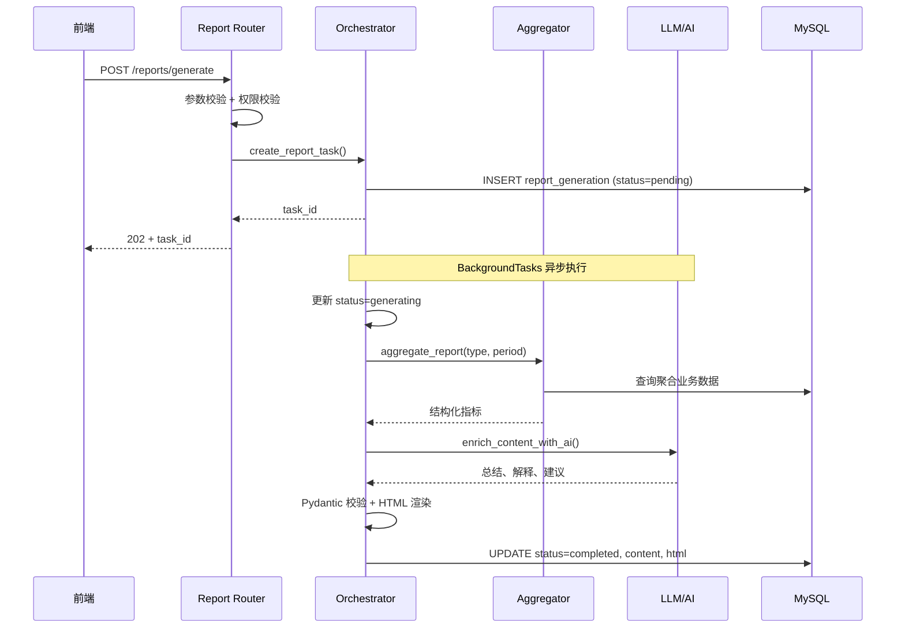
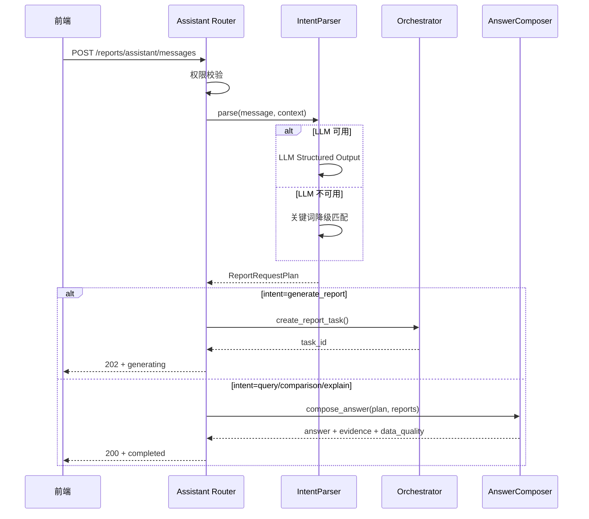
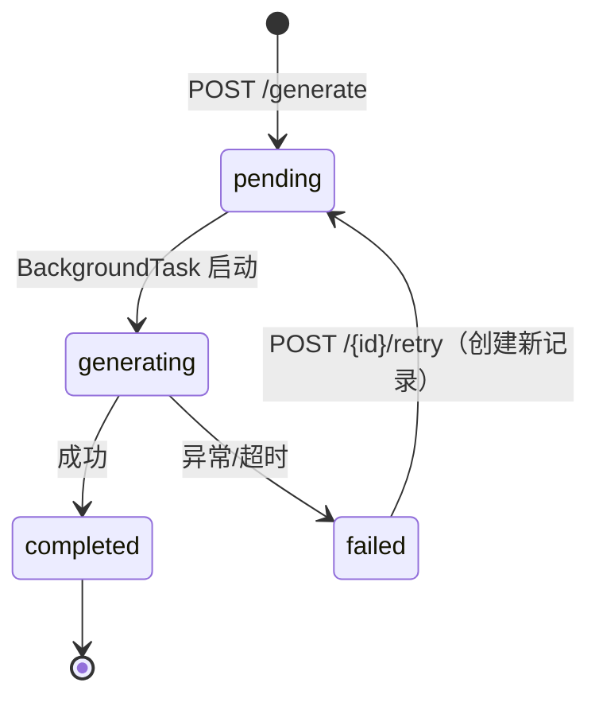
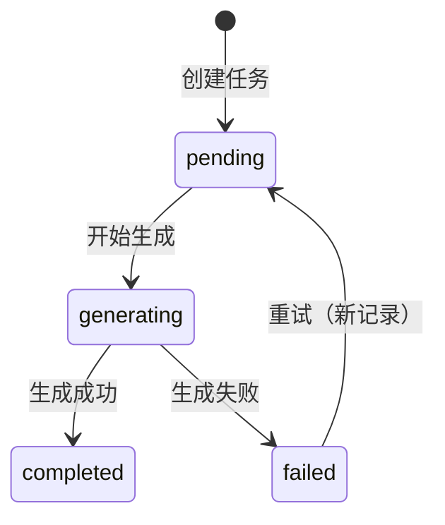
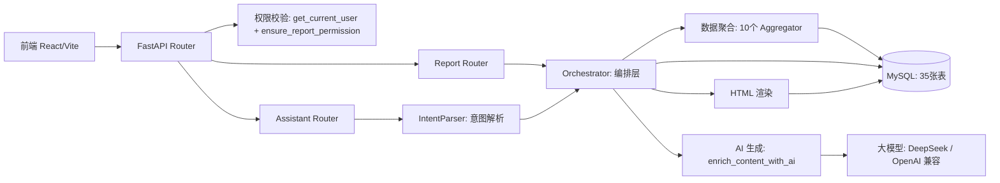

# 智能报告模块交付说明

## 1. 文档信息

| 项目 | 内容 |
|------|------|
| 文档用途 | 智能报告模块的正式交付说明，供团队交接、前端集成、测试验证和后续维护使用 |
| 模块名称 | 智能报告模块（Smart Report Module） |
| 当前分支 | `master` |
| 当前提交 | `214c8c7` — "feat: complete smart report frontend integration and fix BusinessError handler" |
| 生成日期 | 2026-07-12 |
| 交付状态 | 开发环境验收通过，具备团队合并和前端联调条件 |
| 适用对象 | 前端开发人员、后端集成人员、测试人员、项目负责人、后续维护人员 |

---

## 2. 模块一句话说明

> **智能报告模块**让管理者通过**选择报告类型**或**输入自然语言**，自动聚合业务数据、计算核心指标、生成分析报告，并通过**证据链**和**数据质量提示**让每一句结论都可追溯。

---

## 3. 智能报告解决什么业务问题

在留学教育机构中，管理者每天面对大量分散的业务数据——申请进度、材料缺失、投诉处理、渠道成本、心理预警——但这些数据分散在不同表格和系统中，需要人工搜集、整理、制作报表，耗时且容易遗漏。

智能报告模块解决三个核心问题：

1. **数据聚合效率**：自动从多张业务表中查询、聚合、计算指标，不用人工整理
2. **分析门槛**：用户无需知道指标名、表名或接口名，可以直接用自然语言提问
3. **结论可追溯**：每条分析结论都绑定证据链（Evidence），标注数据来源、指标公式和质量状态

---

## 4. 智能报告应用全景

| 使用方式 | 用户做什么 | 系统做什么 | 最终得到什么 |
|----------|-----------|-----------|-------------|
| 固定报告生成 | 选择报告类型和统计周期 | 聚合业务数据并生成分析 | 标准化业务报告 |
| 自然语言生成报告 | 用一句话描述需求 | 识别意图、报告类型和时间范围 | 对应的报告任务 |
| 报告进度查询 | 查看生成状态 | 查询异步任务状态 | `pending` / `generating` / `completed` / `failed` |
| 报告失败重试 | 点击重新生成 | 创建新任务，保留原失败记录 | 新的报告记录 |
| 周期比较 | 查看本期与上期变化 | 对两个时间段进行指标比较 | 趋势、变化值和 Evidence |
| 跨报告分析 | 选择多份相关报告 | 分析不同报告之间的关联 | 四区关系分析 |
| 证据查看 | 查看某个分析结论 | 返回指标来源和依据 | Evidence 证据链 |
| 数据质量提示 | 查看报告可信度 | 检查缺失、异常或不足数据 | DataQuality 分级提示 |
| 智能追问 | 在已有报告上继续提问 | 钻取细节、解释风险、解释指标 | 深入分析结果 |

---

## 5. 用户可以通过哪些方式使用

### 方式一：表单式生成
适合：用户知道自己要哪种报告

```text
选择报告类型 → 选择时间范围 → 填写筛选条件 → 点击生成 → 查看进度 → 查看报告
```

### 方式二：自然语言生成
适合：用户知道业务问题，但不知道报告名称

```text
输入业务问题 → 系统识别意图 → 系统匹配报告 → 系统补全参数 → 创建报告任务 → 查看报告
```

### 方式三：基于已有报告继续分析
适合：用户已经有报告，想做进一步判断

```text
打开已有报告 → 打开智能助手 → 选择周期比较或跨报告分析 → 返回新分析结果
```

---

## 6. 典型用户场景

### 场景一：老板询问当前申请风险

**1. 用户是谁：** 企业老板或高层管理者

**2. 用户遇到什么问题：**
系统里有大量申请数据，但管理者不知道哪些申请最危险、哪些逾期了、哪些缺材料。每周需要下属人工整理，效率低且容易遗漏。

**3. 用户如何提出需求：**
在智能助手对话框中输入自然语言，不需要先选报告类型。

**4. 用户输入示例：**
> 帮我看看当前有哪些申请风险，重点告诉我逾期和材料缺失的情况。

**5. 系统如何理解：**

| 解析项 | 解析结果 |
|--------|---------|
| 用户意图 | `generate_report`（生成报告） |
| 报告类型 | `application_risk`（申请风险报告） |
| 时间范围 | "当前" → 默认本周 |
| 重点关注 | 逾期申请、缺失材料 |
| 用户范围 | 根据当前登录用户权限确定 |
| 执行方式 | 异步生成 |

**6. 系统如何处理（应用层）：**
用户提交需求后，系统先确认用户能查看哪些数据，再收集对应业务数据，计算核心指标，最后生成分析结论。

**7. 技术处理链：**
```text
用户输入
→ POST /api/v1/reports/assistant/messages
→ 身份和权限校验（get_current_user）
→ 意图解析（IntentParser: LLM 或关键词降级）
→ 时间解析（"当前" → 本周日期范围）
→ 报告类型匹配（Registry 白名单校验）
→ 创建异步任务（orchestrator.create_report_task）
→ 业务数据聚合（aggregators.aggregate_application_risk）
→ 指标计算（申请总数、风险分、逾期数、缺材数）
→ 大模型解释（enrich_content_with_ai）
→ Pydantic Schema 校验
→ 保存报告结果
→ 返回 202 + task_id
→ 前端轮询 GET /api/v1/reports/{id}
→ 完成后展示 report_content + report_html + data_quality
```

**8. 用户最终看到什么：**
- 申请总数、高风险/中风险/低风险数量
- 逾期申请数量和明细
- 缺失材料数量和明细
- 风险原因解释
- 管理行动建议
- 数据质量提示（如有数据缺失）
- 每项指标的 Evidence 证据链

**9. 该场景背后的技术能力：**
- 接口：`POST /reports/assistant/messages` + `GET /reports/{id}`
- 报告定义：`application_risk`
- 异步任务：是
- 调用大模型：是（可通过 `REPORT_AI_MODE=local` 降级为确定性解释）
- Evidence：是
- DataQuality：是
- 权限：`ensure_report_permission(user, def.allowed_roles)`

---

### 场景二：招生主管生成本周申请风险报告

**1. 用户是谁：** 招生主管

**2. 用户遇到什么问题：**
每周需要手动整理申请进度表，统计哪些申请有风险，制作周报汇报。

**3. 用户如何提出需求：**
在"生成报告"页面通过表单选择。

**4. 用户操作：**
- 报告类型：申请风险报告
- 统计周期：本周（或手动选择日期范围）
- 筛选条件（可选）：自己负责的项目（owner_id）

**5. 系统处理要点：**
- 权限过滤限制到其负责范围（`generated_by` 记录当前用户）
- 报告采用异步方式生成（避免长时间等待）
- 前端轮询展示生成中状态
- 完成后展示核心指标和风险明细

**6. 用户最终看到什么：**
- 申请风险指标（按风险等级分布）
- 高风险申请明细（风险分、原因、缺失材料）
- 行动建议（按优先级排序）
- Evidence 证据链
- DataQuality 数据质量

---

### 场景三：管理者比较本月与上月变化

**1. 用户是谁：** 部门管理者

**2. 用户遇到什么问题：**
想知道申请风险是变得更严重了还是改善了，但每次只能看一份报告，无法直观对比。

**3. 用户如何提出需求：**
在智能助手中输入自然语言。

**4. 用户输入示例：**
> 本月的申请风险比上个月更严重了吗？

**5. 系统如何理解与处理：**

| 步骤 | 处理 |
|------|------|
| 意图识别 | `compare_reports` |
| 报告类型匹配 | `application_risk`（从 Registry 关键词匹配） |
| 当前周期 | 本月 |
| 对比周期 | 上月（`comparison_relative_period: "last_month"`） |
| 确定性计算 | Python 查询两个周期的报告数据，计算指标变化 |
| 数据质量 | 检查双周期数据完整性和趋势可靠性 |
| 结果展示 | MetricComparison 列表 + ComparisonDataQuality |

**6. Comparison 数据结构：**
- `comparison_period`: 当前周期/对比周期的起止日期和标签
- `metric_comparisons`: 每个指标的三值（当前值、上一期值、差值、变化率、方向）
- `comparison_data_quality`: 双周期质量门禁（allow_values / allow_trend / warnings）
- 每个指标的证据 ID 指向对应的 Evidence

**7. 用户最终看到什么：**
- 比较表格（指标名、上一周期值、当前值、差值、变化率、方向箭头）
- 周期标注（如"本周 vs 上周"）
- 数据质量门禁提示

> **重要原则：** 统计结果和业务事实由 Python 确定性代码产生，大模型只负责解释和总结。Comparison 中的指标值来自数据库查询，不是模型生成。

---

### 场景四：报告生成失败并重试

**1. 用户遇到什么：** 报告生成失败，需要重新生成

**2. 系统如何处理失败：**
- 失败原因记录在 `error_code` 和 `error_message` 字段
- 失败状态：`failed`
- 用户点击"重试" → `POST /api/v1/reports/{id}/retry`

**3. 重试机制：**
- **创建新记录**：不覆盖原失败报告（`retry_of_report_id` 指向原记录，`retry_count` +1）
- **保留原参数**：复用原报告的类型、周期和筛选条件
- **返回 202**：新任务 ID，前端跳转到新详情页
- **幂等性**：相同业务参数不会重复创建任务（`idempotency_key` 机制）

**4. 用户看到什么：**
- 失败页面显示 `error_message`（如"大模型调用超时"）
- 提供重试按钮
- 重试后自动跳转到新报告详情页

---

### 场景五：查看一条结论为什么成立

**1. 用户是谁：** 管理者查看报告后，对某条结论的来源存疑

**2. 用户看到什么结论（示例）：**
> 当前申请风险较上期明显上升，高风险申请从 12 例增加到 17 例。

**3. 用户可以查看什么：**
- **Evidence 证据链**：每条结论的 `evidence_id`（如 E1、E2）绑定到具体指标
  - `evidence_id`: E1
  - `entity_type`: application
  - `metric_name`: risk_score
  - `label`: "申请 A1024 风险分"
  - `value`: 85
  - `source_report_id`: 8
  - `source_tables`: ["application_material_item"]
  - `formula`: "逾期分 + 缺材分 + 异常分"

**4. 核心设计原则：**
> 后端负责产生事实和指标，大模型负责解释这些事实，不能由大模型自行创造业务数据。

---

### 场景六：数据不完整时生成报告

**1. 用户遇到什么：** 部分申请缺少截止日期、材料状态，但仍需要生成报告

**2. 系统如何处理：**
- **允许继续生成**：不因部分数据缺失而拒绝整个报告
- **DataQuality 分级提示**：
  - `ok`：数据完整
  - `warning`：部分数据缺失，统计可能有偏差
  - `degraded`：报告处于降级状态
  - `empty`：当前周期无有效数据
  - `failed`：无法生成报告
- **警告信息**：`warnings` 字段列出具体缺失项（如"7 条申请缺少截止日期"）

**3. 用户看到什么：**
黄色/橙色提示条，告知哪些数据缺失、可能影响哪些统计。不会把缺失数据错误解释为"没有风险"。

---

### 场景七：跨报告综合判断

**1. 用户是谁：** 管理者希望了解不同报告之间的关联

**2. 用户输入示例：**
> 申请风险上升是否和服务响应变慢有关？

**3. 系统如何处理：**
- 意图：`cross_report_analysis`
- 需要两份已完成的报告：申请风险报告 + 服务 SLA 报告
- 权限检查：两份报告都必须属于当前用户或有权限查看
- 生成 `RelationshipSections`：
  - `confirmed_facts`：两份报告都明确显示的事实
  - `related_signals`：两份报告中共同出现的相关信号
  - `possible_explanations`：可能的关联解释（由大模型生成，标记为"可能"）
  - `cannot_confirm`：无法确认的推断

> **重要限制：** 系统只能发现关联信号，不能证明因果关系。`possible_explanations` 中的内容是大模型基于数据的推测，不等于因果结论。

---

### 场景八：自然语言表达不完整

**1. 用户输入：** "帮我出个最近的风险报告"

**2. 系统如何处理模糊输入：**

| 解析项 | 处理方式 |
|--------|---------|
| "风险报告" | 关键词匹配 → `application_risk`（唯一匹配） |
| "最近" | 默认时间解析 → 本周 |
| 模糊报告类型 | 从 `REPORT_KEYWORDS` 查找最佳匹配 |
| 无法匹配 | 返回 `intent: "unknown"`，给出可用报告类型列表 |
| 置信度不足 | 使用默认参数补全，不阻塞用户体验 |

**当前限制：** 系统会根据默认规则补全参数，或返回无法识别提示，暂不支持多轮追问式澄清。

---

## 7. 从一句话到一份报告：完整案例

以下以 **"帮我分析一下本月的申请风险"** 为例，展示完整端到端流程。

### 第一步：用户表达需求
用户在智能助手对话框输入自然语言，不需要知道报告类型编码、不需要手动选参数。

### 第二步：系统解析需求

| 解析项 | 解析结果 |
|--------|---------|
| 用户意图 | `generate_report` |
| 报告类型 | `application_risk` |
| 时间范围 | 本月（当前月份的自然月范围） |
| 用户范围 | 根据 `get_current_user` 确定的当前登录用户权限 |
| 执行方式 | 异步生成（BackgroundTasks） |

### 第三步：系统创建任务

- HTTP 响应：`202 Accepted`
- 响应体：`{"id": 11, "report_type": "application_risk", "status": "pending", ...}`
- 为什么不等待：报告聚合 + LLM 生成需要 30-120 秒，同步返回会让 HTTP 超时

### 第四步：后台生成报告

```text
读取用户权限 (generated_by=当前用户ID)
→ 查询申请材料数据 (application_material_item)
→ 过滤无权访问的数据
→ 统计申请总数、各风险等级数量
→ 统计逾期和缺材数量
→ 形成结构化业务事实
→ 调用大模型生成总结和建议（如 REPORT_AI_MODE=llm）
→ 使用 Pydantic Schema 校验
→ 写入 report_generation 表 (status=completed)
→ 更新任务状态
```

### 第五步：前端查询状态

前端通过 `GET /api/v1/reports/{id}` 轮询，每 2 秒一次，直到 `status` 变为 `completed` 或 `failed`。

### 第六步：用户查看结果

> **以下是展示结构示意，不代表当前真实业务数据。**

```text
申请总数：128
高风险申请：17    中风险申请：34    低风险申请：77
逾期申请：11       缺失关键材料：23

主要发现：
1. 高风险申请主要集中在即将截止的项目
2. 逾期申请中，多数同时存在材料缺失
3. 建议优先跟进截止日期最近且缺少核心材料的申请

数据质量（DataQuality）：
⚠ 7 条申请缺少完整截止日期，相关统计可能存在偏差

证据（Evidence）：
- E1: 申请 A1024 风险分=85，来源：application_material_item 表
- E2: 逾期统计基于 user_id 过滤
```

### 第七步：用户采取行动
- 查看高风险申请明细
- 按风险优先级排序
- 将建议转为行动项跟踪
- 与上月报告比较趋势

---

## 8. 系统能做什么和不能做什么

| 用户需求 | 当前是否支持 | 说明 |
|----------|------------|------|
| 选择固定报告类型并生成 | ✅ 支持 | 10 类报告，通过表单或自然语言 |
| 用自然语言生成报告 | ✅ 支持 | LLM 意图解析 + 关键词降级 |
| 自动识别时间范围 | ✅ 支持 | 本周、本月、上月、最近一周等 |
| 自动补充缺失参数 | ✅ 部分支持 | 按默认规则补全，但不支持追问澄清 |
| 多轮追问澄清 | ❌ 不支持 | 单轮意图解析，参数不足时使用默认值 |
| 多轮钻取分析 | ✅ 支持 | drill_down 意图，基于已有报告深入 |
| 创建自定义报告类型 | ❌ 不支持 | 只能使用 Registry 中已注册的报告类型 |
| 修改报告指标结构 | ❌ 不支持 | 报告 Schema 由代码定义，不支持运行时修改 |
| 查看报告生成进度 | ✅ 支持 | 轮询 `GET /reports/{id}` |
| 失败后重试 | ✅ 支持 | 创建新任务，保留原记录 |
| 比较不同周期 | ✅ 支持 | `compare_reports` 意图 |
| 分析多份报告关系 | ✅ 支持 | `cross_report_analysis` 意图 |
| 直接修改业务数据 | ❌ 不支持 | 智能报告只读 |
| 自动执行管理动作 | ❌ 不支持 | 可生成建议，但需人工确认 |
| 在离线/无 LLM 环境下生成报告 | ✅ 支持 | `REPORT_AI_MODE=local` 降级为确定性模板 |
| 证明两个指标存在因果关系 | ❌ 不支持 | 只能发现相关性，不能证明因果 |

---

## 9. 应用价值

1. **降低报告使用门槛**：用户不需要了解数据库、指标表和接口名称，可以直接表达业务问题
2. **减少人工整理时间**：系统自动完成数据查询、聚合、指标计算和报告结构化
3. **提升风险发现速度**：管理者可以更快发现逾期、材料缺失、服务异常或转化问题
4. **增强结论可解释性**：通过 Evidence 和 DataQuality，让用户知道结论来源以及数据是否可靠
5. **支持持续复盘**：通过周期比较，识别指标改善或恶化趋势
6. **支持管理决策**：通过跨报告分析，帮助管理者从单一指标查看转向综合判断

---

## 10. 当前交付范围

| 功能 | 当前状态 | 对外接口 | 说明 |
|------|---------|---------|------|
| 报告类型查询 | ✅ 已完成 | `GET /api/v1/reports/types` | 返回10类报告的元数据和 JSON Schema |
| 报告生成（异步） | ✅ 已完成 | `POST /api/v1/reports/generate` | 202 异步语义，幂等键防重复 |
| 报告列表（分页筛选） | ✅ 已完成 | `GET /api/v1/reports` | 按类型、状态、日期筛选 |
| 报告详情查询 | ✅ 已完成 | `GET /api/v1/reports/{id}` | 用于轮询状态 |
| 失败重试 | ✅ 已完成 | `POST /api/v1/reports/{id}/retry` | 创建新记录 |
| 报告行动项管理 | ✅ 已完成 | `POST/GET /reports/{id}/actions` | 创建和查询 |
| 报告计划 | ✅ 已完成 | `/api/v1/report-schedules` | CRUD |
| 报告数据维护 | ✅ 已完成 | `/api/v1/report-data/*` | 四类数据源 |
| 智能报告助手 | ✅ 已完成 | `POST /api/v1/reports/assistant/messages` | 自然语言交互 |
| 意图识别（LLM） | ✅ 已完成 | 同上 | Structured Output |
| 意图识别（关键词降级） | ✅ 已完成 | 同上 | LLM 不可用时自动切换 |
| 多轮钻取 | ✅ 已完成 | 同上 | drill_down 意图 |
| 风险解释 | ✅ 已完成 | 同上 | explain_risk 意图 |
| 周期比较 | ✅ 已完成 | 同上（compare_reports） | MetricComparison + ComparisonDataQuality |
| 跨报告关系分析 | ✅ 已完成 | 同上（cross_report_analysis） | RelationshipSections |
| Evidence 证据链 | ✅ 已完成 | 内置在助手响应中 | 五元绑定 |
| DataQuality | ✅ 已完成 | 内置在报告和助手响应中 | 五级质量评估 |
| 权限控制 | ✅ 已完成 | 所有接口 | RBAC + 记录级 |
| 前端集成 | ✅ 已完成 | 6个页面 + API 层 | React/Vite |

### 非本次交付范围
- Iteration 4
- RAG / 知识库增强
- 多 Agent 协作
- Redis / Celery / 分布式任务
- Docker / Nginx / 生产部署
- 生产环境监控和告警

---

## 11. 核心业务流程

### 11.1 普通报告生成流程



### 11.2 智能助手流程



### 11.3 失败重试流程



### 11.4 报告状态机



**状态说明：**
- `pending`：任务已创建，等待 BackgroundTasks 执行
- `generating`：后台正在聚合数据和调用 LLM
- `completed`：报告已生成，可查看 `report_content` 和 `report_html`
- `failed`：生成失败，`error_code` + `error_message` 记录原因

**接口对应关系：**
- 创建任务：`POST /api/v1/reports/generate` → 202
- 查询状态/详情：`GET /api/v1/reports/{report_id}` → 200
- 重试：`POST /api/v1/reports/{report_id}/retry` → 202

---

## 12. 系统架构



**层级职责：**

| 层级 | 主要文件 | 职责 |
|------|---------|------|
| Router | `routers/report.py`, `routers/report_assistant.py` 等 | HTTP 请求接收、参数校验、依赖注入 |
| Schema | `schemas/report.py`, `services/reporting/assistant/schemas.py` | Pydantic 请求/响应验证 |
| Service | `services/reporting/orchestrator.py`, `services/reporting/ai_generator.py` | 业务编排、AI 调用 |
| Aggregator | `services/reporting/aggregators.py` | 10 类报告的数据聚合 |
| Registry | `services/reporting/registry.py` | 报告类型元数据注册 |
| Intent Parser | `services/reporting/assistant/intent_parser.py` | 自然语言 → 结构化计划 |
| LLM Config | `services/reporting/llm_config.py` | LLM 连接配置 |
| Model | `models/report.py` | ORM 数据模型（4 张报告表） |
| Renderer | `services/reporting/renderer.py` | HTML 模板渲染 |

---

## 13. 接口清单

| 接口用途 | Method | Path | 权限 | 成功状态 | 主要响应字段 |
|----------|--------|------|------|---------|-------------|
| 报告类型列表 | GET | `/api/v1/reports/types` | 登录即可 | 200 | `report_type`, `label`, `allowed_roles`, `available_filters`, `json_schema` |
| 创建报告任务 | POST | `/api/v1/reports/generate` | management 角色 | **202** | `id`, `report_type`, `status`, `schema_version` |
| 报告列表 | GET | `/api/v1/reports` | management 角色 | 200 | `items[]`, `total`, `page`, `page_size` |
| 报告详情/状态 | GET | `/api/v1/reports/{id}` | 记录级权限 | 200 | `report_content`, `report_html`, `data_quality`, `status` |
| 失败重试 | POST | `/api/v1/reports/{id}/retry` | management 角色 | **202** | 新记录 `id`, `retry_of_report_id` |
| 创建行动项 | POST | `/api/v1/reports/{id}/actions` | management 角色 | 200 | `id`, `suggestion_text`, `risk_code`, `status` |
| 查询行动项 | GET | `/api/v1/reports/{id}/actions` | management 角色 | 200 | 行动项列表 |
| 更新行动项 | PATCH | `/api/v1/reports/actions/{action_id}` | 记录级权限 | 200 | 更新后的行动项 |
| 智能助手 | POST | `/api/v1/reports/assistant/messages` | management 角色 | 200/202 | `status`, `intent`, `answer`, `evidence`, `conversation_context` |
| 报告计划 CRUD | GET/POST | `/api/v1/report-schedules` | 管理员/经理 | 200/201 | 计划列表/创建 |
| 报告计划详情 | GET/PATCH/DELETE | `/api/v1/report-schedules/{id}` | 管理员/经理 | 200 | 计划详情 |
| 数据档案-申请材料 | GET/POST | `/api/v1/report-data/application-materials` | management 角色 | 200/201 | 材料记录列表/创建 |
| 数据档案-渠道成本 | GET/POST | `/api/v1/report-data/channel-costs` | management 角色 | 200/201 | 成本记录列表/创建 |
| 数据档案-合同 | GET/POST | `/api/v1/report-data/contracts` | management 角色 | 200/201 | 合同记录列表/创建 |
| 数据档案-回款 | GET/POST | `/api/v1/report-data/payments` | management 角色 | 200/201 | 回款记录列表/创建 |
| 行动兼容接口 | GET/PATCH | `/api/v1/report-actions/{action_id}` | 记录级权限 | 200 | 同行动项 |

---

## 14. 请求与响应契约

### 14.1 报告生成

**Request：**
```json
POST /api/v1/reports/generate
Headers: {
  "Authorization": "Bearer <JWT>",
  "Idempotency-Key": "<unique-key>"
}
Body: {
  "report_type": "application_risk",
  "report_title": "2026年7月申请风险报告",
  "period_start": "2026-07-01",
  "period_end": "2026-07-11",
  "filters": {"owner_id": 1}
}
```

**Response (202)：**
```json
{
  "id": 11,
  "report_type": "application_risk",
  "report_title": "2026年7月申请风险报告",
  "status": "pending",
  "schema_version": 2,
  "period_start": "2026-07-01",
  "period_end": "2026-07-11",
  "trigger_source": "manual",
  "generated_by": 1,
  "create_time": "2026-07-12T10:30:00"
}
```

### 14.2 智能助手请求

**Request：**
```json
POST /api/v1/reports/assistant/messages
Body: {
  "message": "帮我分析一下本月的申请风险",
  "conversation_context": {
    "conversation_id": "550e8400-e29b-41d4-a716-446655440000",
    "last_report_id": null,
    "last_report_type": null,
    "last_period_start": null,
    "last_period_end": null,
    "referenced_entities": [],
    "previous_intent": null
  },
  "client_request_id": "req-1752665438-a3f2b1c"
}
```

**Response (generate_report, 202 语义映射)：**
```json
{
  "status": "generating",
  "intent": "generate_report",
  "report_id": 12,
  "report_type": "application_risk",
  "answer": "已创建申请风险报告任务，正在后台生成...",
  "assumptions": ["时间范围默认为本月", "统计对象为当前用户有权限的申请"],
  "suggested_follow_ups": ["报告生成好了吗？", "查看报告详情"],
  "conversation_context": {
    "conversation_id": "550e8400-e29b-41d4-a716-446655440000",
    "last_report_id": 12,
    "last_report_type": "application_risk"
  }
}
```

**Response (compare_reports)：**
```json
{
  "status": "completed",
  "intent": "compare_reports",
  "answer": "本月申请风险较上月有所上升...",
  "evidence": [...],
  "comparison_period": {
    "current_start": "2026-07-01", "current_end": "2026-07-11",
    "previous_start": "2026-06-01", "previous_end": "2026-06-30",
    "current_label": "本月", "previous_label": "上月",
    "assumptions": ["比较基于发版后已有数据的两个完整自然月"]
  },
  "metric_comparisons": [
    {
      "report_type": "application_risk",
      "metric_name": "high_risk_count",
      "label": "高风险申请数",
      "current_value": 17, "previous_value": 12,
      "delta": 5, "change_rate": 0.417,
      "direction": "up",
      "current_evidence_id": "E1", "previous_evidence_id": "E2"
    }
  ],
  "comparison_data_quality": {
    "current": {...}, "previous": {...},
    "allow_values": true, "allow_trend": true,
    "warnings": []
  },
  "conversation_context": {...}
}
```

### 14.3 HTTP 状态码说明

| 状态码 | 触发条件 | 前端处理 |
|--------|---------|---------|
| 200 | 查询/操作成功 | 正常展示 |
| **202** | 报告任务创建成功/重试成功 | 保存 task_id，开始轮询 |
| 400 | 不支持的报告类型 | 提示用户选择有效类型 |
| 401 | 未登录/Token 失效 | 清除 Token，跳转登录页 |
| 403 | 学生访问管理报告/权限不足 | 保留页面，提示权限不足 |
| 404 | 报告不存在或无权查看 | 显示资源不存在 |
| 422 | 参数校验失败 | 显示具体字段错误 |
| 500 | 助手内部错误（status=error） | 允许重试 |
| 503 | 助手功能关闭 | 提示"智能助手未启用" |

---

## 15. 报告类型与能力矩阵

| report_type | 中文名称 | 主要数据源 | schema_version | 默认角色 | 默认周期 |
|-------------|---------|-----------|---------------|---------|---------|
| `customer_ops` | 客户经营分析报告 | crm_lead, crm_follow_up | 2 | management | previous_week |
| `daily_summary` | 员工日报汇总报告 | employee_daily_report | 2 | management | previous_day |
| `weekly_summary` | 综合经营周报 | 跨模块聚合 | 2 | admin,manager | previous_week |
| `psych_weekly` | 学生心理预警周报 | student_psych_alert, student_psych_record | 2 | admin,manager,team_leader | previous_week |
| `complaint_weekly` | 投诉处理周报 | student_feedback_ticket | 2 | management | previous_week |
| `application_risk` | 申请风险报告 | application_material_item | 2 | management | previous_week |
| `sales_funnel` | 销售漏斗报告 | crm_lead, crm_follow_up | 2 | management | previous_week |
| `channel_roi` | 渠道 ROI 报告 | marketing_channel_cost, customer_contract | 2 | admin,manager | previous_week |
| `service_sla` | 服务 SLA 报告 | student_feedback_ticket, student_admin_service | 2 | management | previous_week |
| `action_closure` | 报告行动闭环报告 | report_action | 2 | admin,manager | previous_week |

---

## 16. 核心数据结构

### 报告任务 (ReportGeneration)

对应数据库表 `report_generation`，是每次生成任务的生命周期记录。

核心字段：`id`, `report_type`, `report_title`, `status`(pending/generating/completed/failed), `report_content`(JSON), `report_html`(HTML), `data_quality`, `error_code`, `error_message`, `idempotency_key`, `retry_of_report_id`, `retry_count`, `trigger_source`(manual/schedule/retry/system), `generated_by`

### Evidence (证据项)

解释"这个数字从哪来"。每个 Evidence 包含：`evidence_id`(E1/E2等), `entity_type`, `entity_id`, `metric_name`, `label`, `value`, `unit`, `source_report_id`, `source_tables[]`, `formula`

**用途：** 让用户知道每条分析结论的数据来源、计算公式和可靠性，防止大模型编造数据。

**生成机制（`guardrails.py`）：** 从工具返回的聚合结果中提取三类证据——申请风险 item 的业务字段（如 `risk_score`）、实体详情中的指标值、以及 MetricTrace 中的 `formula` 和 `source_tables` 追溯信息。比较场景下通过 `hashlib.sha256` 生成不可交换的 Evidence ID。LLM 在回答中使用 `{{E1}}` 占位符引用证据编号，Python 替换为实际值后执行 `validate_numbers_in_answer()` 数字防幻觉校验。

### DataQuality (数据质量)

五级评估：`ok` / `warning` / `degraded` / `empty` / `failed`。附带 `warnings[]` 和 `data_source`(database/mock/local/mixed)。

**用途：** 在数据缺失或不足时给用户明确提示，避免用户误以为报告结果完全准确。

### MetricComparison (指标比较)

周期比较的结构：`report_type`, `metric_name`, `label`, `current_value`, `previous_value`, `delta`, `change_rate`, `direction`(up/down/flat/unknown), `unit`, `current_evidence_id`, `previous_evidence_id`

**用途：** 支持"本月 vs 上月"等对比场景，每个比较指标都有独立的 Evidence。

### ComparisonPeriod (比较周期)

`current_start/end`, `previous_start/end`, `current_label`, `previous_label`, `assumptions[]`

**用途：** 说明对比的两个时间窗口和默认假设。

### ComparisonDataQuality (双周期数据质量)

`current`(当前周期质量), `previous`(对比周期质量), `allow_values`(值可比), `allow_trend`(趋势可信), `warnings[]`

**用途：** 周期比较场景下，确认两个周期的数据都完整且可以比较。

### RelationshipSections (关系分析)

四区结构：`confirmed_facts[]`, `related_signals[]`, `possible_explanations[]`, `cannot_confirm[]`

**用途：** 跨报告分析时，将确定事实、相关信号、可能解释和无法确认事项分类展示。

**白名单约束：** 跨报告分析通过 `cross_report_catalog.py` 实行白名单准入，当前仅开放 4 组审核过的组合（`complaint_weekly + service_sla`、`sales_funnel + customer_ops`、`application_risk + action_closure`、`channel_roi + sales_funnel`），每组有独立的角色限制。未在白名单中的组合请求会被 `validate_cross_report_request()` 的 6 项 fail-closed 安全检查拒绝。

### ReportRequestPlan (助手解析结果)

LLM 输出的候选计划，经 Python 校验后执行：`intent`, `report_type`, `relative_period`, `period_start/end`, `comparison_relative_period`, `confidence`, `assumptions[]`, `focus_metrics[]`

**用途：** 连接自然语言和报告生成间的桥梁。

---

## 17. 权限与数据安全

### 角色权限矩阵

| 角色 | 可访问报告接口 | 可查看范围 | 禁止操作 |
|------|-------------|-----------|---------|
| admin（系统管理员） | 全部 | 全部报告 | — |
| manager（部门经理） | 全部 | 管理范围报告 | — |
| team_leader（班主任） | 部分（非 admin/manager 限定） | 授权范围 | 禁止访问 `weekly_summary`, `channel_roi`, `action_closure` |
| employee（员工/顾问） | 部分 | 仅自己生成的报告 | 禁止访问管理范围报告 |
| student（学生） | **禁止全部** | — | 403 Forbidden |

### 权限过滤层

1. **接口级**：`get_current_user` 校验 JWT Token
2. **角色级**：`ensure_management_user(user)` — 学生直接返回 403
3. **报告类型级**：`ensure_report_permission(user, definition.allowed_roles)` — 检查角色是否在报告类型允许列表中
4. **记录级**：`_check_report_row_access(report, user)` — admin/manager 可查看管理范围，普通员工只看到自己生成的

### 安全设计要点

- LLM 输入已经过权限过滤，不包含用户无权访问的数据
- `conversation_context` 由前端传回，服务端不持久化会话内容
- 报告内容中不保存心理咨询原文、投诉原文等敏感长文本
- `aggregated_data_snapshot` 只保存聚合结果，不含个人身份信息

---

## 18. 异步任务与状态机

### 当前实现
- **任务机制**：FastAPI `BackgroundTasks`
- **创建接口**：`POST /api/v1/reports/generate` → 202
- **查询接口**：`GET /api/v1/reports/{id}`
- **轮询建议**：每 2 秒一次，`status` 变为 `completed` 或 `failed` 时停止

### 已知限制
- `BackgroundTasks` 在应用重启后会丢失未完成的任务（状态停留在 `generating`）
- 当前没有任务超时机制，可能导致任务长期卡在 `generating` 状态
- 同步模型调用可能阻塞（180 秒超时）
- **不适用于生产环境**，建议后续迁移到 Celery 或 Redis Queue

---

## 19. 智能能力与降级机制

### 大模型负责什么
- 意图识别（用户想生成报告、钻取、比较还是解释）
- 报告类型匹配和建议
- 时间范围解析（"本月"→具体日期）
- 自然语言总结和解释
- 风险解释和建议生成

### 大模型不负责什么
- **数据聚合和指标计算**（Python 确定性代码完成）
- **数据库查询**（模型不接触 SQL）
- **权限判断**（Python 校验）
- **报告类型白名单校验**（Registry 约束）
- **Evidence 生成**（Python 从数据库中提取）

### 降级机制

| 场景 | 降级策略 |
|------|---------|
| `REPORT_AI_MODE=local` | 使用确定性模板代替 LLM 生成，报告仍有完整的数据指标 |
| `REPORT_ASSISTANT_LLM_ENABLED=false` | 助手使用关键词匹配代替 LLM 意图解析 |
| LLM 调用超时/失败 | 关键词降级匹配 + 默认模板解释 |
| 模型输出 Schema 校验失败 | 重试一次，仍失败则降级为确定性输出 |

### 核心原则
> 统计结果和业务事实应由后端确定性代码产生，大模型主要负责意图理解、解释、总结和建议，不能作为核心业务数据的唯一来源。

---

## 20. 前端集成说明

### 请求链路
```text
登录 → 保存 JWT → Axios baseURL /api/v1 → 自动注入 Authorization: Bearer <token>
→ GET /reports/types（获取报告类型列表）
→ POST /reports/generate（创建任务 → 202）
→ GET /reports/{id}（轮询，2秒间隔）
→ completed：展示 report_content + report_html + data_quality
→ failed：展示错误信息 + 重试按钮
→ POST /reports/assistant/messages（自然语言交互）
→ 原样传递 conversation_context
```

### 关键注意事项

1. **202 不是错误**：报告生成返回 202，前端必须识别为"任务创建成功，等待生成"
2. **轮询用同一个 ID**：`POST /generate` 返回的 `id` 用于后续 `GET /reports/{id}` 轮询
3. **幂等键复用**：网络重试时复用同一个 `Idempotency-Key`，不复用会创建重复任务
4. **conversation_context 原样传回**：助手响应的 `conversation_context` 必须在下一次请求中原样提交
5. **Evidence 只展示不计算**：前端不计算指标、不拼接因果结论
6. **空值兼容**：`report_content`、`report_html`、`data_quality`、`error_code`、`error_message` 都可能为 null
7. **枚举映射**：`status`(pending/generating/completed/failed)、`direction`(up/down/flat/unknown)、`data_quality.level`(ok/warning/degraded/empty/failed)

### 错误处理
- **401**：清理 Token → 跳转登录
- **403**：保留页面 + toast 提示权限不足
- **404**：展示"报告不存在"页面
- **422**：展示具体字段校验失败信息
- **500**：展示"生成失败"，提供重试
- **503**：展示"智能助手未启用"

---

## 21. 配置与运行条件

### 环境变量（仅列出变量名和作用，不包含密钥）

| 变量名 | 作用 | 默认值 |
|--------|------|--------|
| `REPORT_AI_MODE` | AI 模式：`local`(本地模板) / `llm`(大模型) | `local` |
| `REPORT_LLM_PROVIDER` | LLM 提供商 | `deepseek` |
| `REPORT_LLM_MODEL` | 模型名称 | `deepseek-v4-pro` |
| `REPORT_LLM_BASE_URL` | LLM API 地址 | `https://api.deepseek.com` |
| `REPORT_LLM_API_KEY` | LLM API 密钥 | 无默认值，llm 模式必填 |
| `REPORT_LLM_TIMEOUT` | LLM 调用超时（秒） | `180` |
| `REPORT_LLM_MAX_RETRIES` | LLM 调用最大重试次数 | `2` |
| `REPORT_ASSISTANT_ENABLED` | 智能助手是否启用 | — |
| `REPORT_ASSISTANT_LLM_ENABLED` | 助手是否使用 LLM（否则关键词降级） | — |

### 运行依赖
- Python 3.13+
- MySQL 8.0（`education_service` 库）
- 无 Redis / MinIO / Celery 依赖
- 密钥仅保存在本地 `.env`，不进入代码

---

## 22. 测试与验收结果

### 自动化测试详情

| 测试文件 | 测试数 | 通过 | 覆盖内容 |
|----------|--------|------|---------|
| `test_report_integration_contract.py` | 4 | 4 | OpenAPI 快照一致性、16 个冻结路径完整性、前端 operation catalog 覆盖率、.env.example 无真实密钥 |
| `test_reporting_v2_contracts.py` | 4 | 4 | Registry 含 10 类报告且 schema_version=2、模板/权限/周期完整性、ReportEnvelope 校验、5 组前端别名字段映射 |
| `test_report_assistant_api.py` | 8 | 8 | 路由注册顺序、模块可导入、POST /messages 端点存在、prefix 正确性 |
| `test_integration_recovery.py` | 8 | 8 | 助手恢复逻辑、错误处理 |
| **合计** | **24** | **24** | 全部为静态/代码级测试，不涉及真实数据库和 LLM 调用 |
| 后端全量 | 510 | 507 | 3 个预存失败（OpenAPI 安全 schema、seed 脚本、main reload） |

### 测试覆盖缺口

以下链路无自动化测试覆盖：
- `POST /api/v1/reports/generate` 的幂等性（Idempotency-Key 去重）
- `POST /api/v1/reports/{report_id}/retry` 的重试语义（创建新记录、保留原记录）
- 报告计划 CRUD 接口
- 报告数据入口四类数据源的增删查
- 助手 API 的业务逻辑（意图识别、计划解析、回答生成）

*3 个预存失败，干净基线也复现，非本次变更引入

### 前端测试

| 测试类型 | 结果 |
|----------|------|
| 单元测试 (vitest) | 54 passed, 4 files |
| 验证脚本 (editorial + catalog) | 92 operations verified |
| TypeScript 编译 | 零错误 |
| 生产构建 (vite build) | 通过 |

### 验收层次

| 验证层次 | 状态 |
|----------|------|
| 自动化测试通过 | ✅ |
| 代码审查通过 | ✅ |
| 接口级验证 | ✅ (OpenAPI 契约 4/4) |
| 真实 MySQL 验证 | ✅ (验收记录确认 8 张核心表) |
| 真实 DeepSeek 调用验证 | ✅ (验收记录确认 7 条链路) |
| 生产环境验证 | ❌ 尚未执行 |

---

## 23. 已知限制与风险

| 风险 | 当前情况 | 影响 | 建议 |
|------|---------|------|------|
| BackgroundTasks 丢失 | 应用重启后未完成任务停留在 generating | 用户看到报告永远在生成中 | 生产环境迁移到 Celery/Redis Queue |
| 同步 LLM 调用阻塞 | 180 秒超时 | 高并发下可能耗尽 worker | 异步调用 + 连接池 |
| LLM 输出不稳定 | Schema 校验失败后重试 1 次 | 偶发报告生成失败 | 增加确定性 fallback 的覆盖范围 |
| 前端轮询压力 | 每 2 秒轮询一次 | 多用户同时生成可能加大服务器负载 | 引入 Redis Pub/Sub 或 WebSocket |
| 重复提交风险 | Idempotency-Key 依赖前端正确传参 | 前端 bug 可能导致重复任务 | 后端增加基于业务参数的幂等校验 |
| 跨报告分析数据不完整 | 需要两份已完成报告 | 任一份未完成都无法分析 | 前端明确提示需要哪些报告 |
| 学生角色完全禁止 | 403 拦截 | 学生无法使用任何报告功能 | 如后续需开放学生报告，需要独立的报告类型和权限 |
| 大模型可能编造数据 | Prompt 约束 + Schema 校验 + Evidence 核查 | 仍有极小概率 | 增加后处理事实核查层 |

---

## 24. 团队合并注意事项

### 公共文件保护

以下文件在团队合并时**不能被任何模块整体覆盖**，只能逐项手工合并：

- `main.py` — 路由注册入口
- `config.py` — 全局配置
- `routers/__init__.py` — 路由汇总
- `models/__init__.py` — ORM 模型汇总
- `utils/exceptions.py` — 业务异常类（本次已修复）
- 前端 `router/index.tsx`、`Sidebar.tsx`、`api-client.ts`

### 智能报告模块新增/修改文件

| 文件 | 类型 | 合并风险 |
|------|------|---------|
| `utils/exceptions.py` | 公共文件 | 已合并，其他人需保留此版本 |
| `routers/report.py` | 模块文件 | 低，独立路由 |
| `routers/report_assistant.py` | 模块文件 | 低 |
| `routers/report_action.py` | 模块文件 | 低 |
| `routers/report_data.py` | 模块文件 | 低 |
| `routers/report_schedule.py` | 模块文件 | 低 |
| `services/reporting/` | 模块目录 | 低，独立服务 |
| `models/report.py` | 模块文件 | 低 |
| `docs/integration/openapi-iteration3.json` | 契约文件 | 需重新导出 |

### 合并后验证命令

```bash
python scripts/export_report_openapi.py
python -m pytest tests/test_report_integration_contract.py -q
python -m pytest tests/ -q
cd frontend && npm run build
```

---

## 25. 交付文件清单

| 文件 | 用途 | 状态 |
|------|------|------|
| `routers/report.py` | 报告 Router | ✅ |
| `routers/report_assistant.py` | 助手 Router | ✅ |
| `routers/report_action.py` | 行动项 Router | ✅ |
| `routers/report_data.py` | 数据维护 Router | ✅ |
| `routers/report_schedule.py` | 计划 Router | ✅ |
| `services/reporting/` | 核心服务（orchestrator, aggregators, ai_generator, renderer, llm_config, registry） | ✅ |
| `services/reporting/assistant/` | 助手服务（intent_parser, service, answer_composer, schemas） | ✅ |
| `models/report.py` | ORM 模型 | ✅ |
| `schemas/report.py` | API Schema | ✅ |
| `docs/integration/openapi-iteration3.json` | OpenAPI 契约 | ✅ |
| `docs/integration/智能报告模块_集成联调说明.md` | 联调说明 | ✅ |
| `docs/integration/智能报告模块_真实链路验收记录.md` | 验收记录 | ✅ |
| `docs/integration/智能报告模块_交付说明.md` | 本文档 | ✅ |
| `frontend/src/api/reports.ts` | 前端报告 API | ✅ |
| `frontend/src/api/report-assistant.ts` | 前端助手 API | ✅ |
| `frontend/src/api/report-data.ts` | 前端数据 API | ✅ |
| `frontend/src/api/report-schedules.ts` | 前端计划 API | ✅ |
| `frontend/src/types/report.ts` | 前端报告类型 | ✅ |
| `frontend/src/types/report-assistant.ts` | 前端助手类型 | ✅ |
| `frontend/src/pages/reports/*.tsx` | 前端6个页面 | ✅ |
| `frontend/src/components/report-assistant/*.tsx` | 助手组件 | ✅ |
| `tests/test_report_*.py` | 测试 | ✅ |

---

## 26. 后续建议

### P0：合并或上线前必须完成
- 统一 `BackgroundTasks` 丢失问题的处理方案
- 确认 REPORT_LLM_API_KEY 等密钥配置在目标环境中可用

### P1：建议近期完成
- 增加任务超时检测和清理机制
- 前端增加轮询超时提示（超过 5 分钟未完成时告警）
- 补充未覆盖模块（crm、profile、student）的专项测试环境

### P2：后续优化
- 从 BackgroundTasks 迁移到 Celery 或 Redis Queue
- 引入 WebSocket 推送替代前端轮询
- 增加报告生成的 Token 消耗统计
- Pydantic V2 `ConfigDict` 迁移

---

## 27. 最终交付结论

| 评估维度 | 结论 |
|----------|------|
| 是否具备团队合并条件 | ✅ 是。智能报告模块代码独立，公共文件仅修改 `utils/exceptions.py`（Bug 修复），不影响其他模块 |
| 是否具备前端联调条件 | ✅ 是。API 契约冻结，OpenAPI 已导出，TypeScript 类型对齐，前端 54 测试通过 |
| 是否具备测试环境验收条件 | ✅ 是。真实 MySQL + DeepSeek 链路已验收通过 |
| 是否具备生产部署条件 | ❌ 否。当前使用 BackgroundTasks，存在任务丢失风险；需先迁移到持久化任务队列 |
| 当前阻塞项 | 无。所有已知问题已记录 |
| 推荐下一步 | 团队合并 → 统一前端逐角色验收 → Iteration 4 规划 |

---

> **文档声明：** 本文档所有结论基于 2026-07-12 的 `master` 分支代码、OpenAPI 契约、自动化测试和真实链路验收记录。接口行为以当前代码和 OpenAPI 为准。标记为"待确认"或"未验证"的内容需在实际环境中进一步核实。
